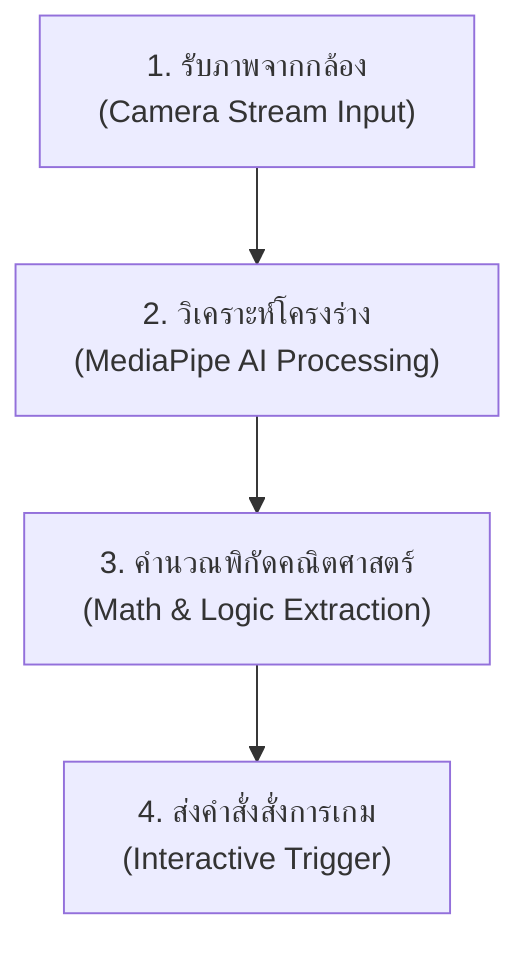

# 🛡️ คู่มือข้อมูลนวัตกรรม 4 ฟีเจอร์ใหม่ & เก็งแนวคำถามกรรมการ (รอบ 2)
**โครงการ: NextGen Play v5 (นวัตกรรมการเรียนรู้แบบ Active Learning ผสาน Edge AI)**
**ผู้นำเสนอโครงงาน: ครู วีรภัทร์  จิตประพันธ์  โรงเรียนเทศบาล ๓ (โศภนพิทยาคุณานุสรณ์)**

เอกสารฉบับนี้จัดทำขึ้นเป็นพิเศษเพื่อสรุปข้อมูลสำคัญเชิงเทคนิค แนวคิดการออกแบบ และขั้นตอนการทำงานเชิงลึกของ 4 ฟีเจอร์ใหม่ที่พัฒนาเพิ่มเติมในระบบ **NextGen Play v5** พร้อมทริกการพูดอธิบายการประมวลผลกล้อง AI และการเก็งแนวคำถามที่กรรมการผู้เชี่ยวชาญน่าจะถามในรอบการแข่งขัน เพื่อให้ครูวีรภัทร์และทีมงานนำไปใช้วางในเอกสารหรือประกอบการซ้อมนำเสนอได้อย่างสมบูรณ์แบบที่สุด

---

## 📂 ส่วนที่ 1: ขั้นตอนการทำงานเชิงลึกของกล้องจับท่าทาง AI (สคริปต์อธิบายเข้าใจง่าย)

หากกรรมการถามหรือคุณครูต้องการอธิบายว่า **"กล้องเว็บแคมจับท่าทางและนำมาสั่งงานในมินิเกม AI ได้อย่างไร?"** สามารถสรุปขั้นตอนทางวิศวกรรมเทคโนโลยีออกเป็น 4 ขั้นตอนสั้นๆ ดังนี้ครับ:

### 🛠️ 4 ขั้นตอนการประมวลผลเรียลไทม์ฝั่งไคลเอนต์ (Client-Side Pipeline)

1.  **การรับและสตรีมภาพ (Camera Stream Input)**:
    *   ระบบเว็บแอปพลิเคชันจะขอสิทธิ์เข้าถึงอุปกรณ์กล้องของนักเรียนผ่านเบราว์เซอร์ด้วยคำสั่ง `navigator.mediaDevices.getUserMedia`
    *   ดึงเฟรมภาพวิดีโอสด (Live Video Frame) เข้ามาทีละเฟรมอย่างต่อเนื่อง โดยใช้ลูป `requestAnimationFrame` ซึ่งช่วยให้ดึงภาพได้ความเร็วสูงถึง 30-60 เฟรมต่อวินาที (FPS) โดยไม่หน่วงระบบ
2.  **การตรวจจับโครงร่างด้วย AI (MediaPipe Processing)**:
    *   ภาพแต่ละเฟรมจะถูกส่งไปยังโมเดลโครงข่ายประสาทเทียมน้ำหนักเบา (Lightweight Deep Learning Models) ของ Google ได้แก่:
        *   **MediaPipe Pose Model**: สำหรับตรวจจับจุดพิกัดสำคัญบนร่างกาย 33 จุด (เช่น จุดข้อต่อตา หู ไหล่ สะโพก)
        *   **MediaPipe Hands Model**: สำหรับตรวจจับจุดพิกัดสำคัญบนนิ้วมือข้างละ 21 จุด (เช่น ข้อต่อนิ้ว ปลายนิ้วโป้ง นิ้วชี้)
    *   การประมวลผลทั้งหมดเกิดขึ้นบนเบราว์เซอร์ของเด็กโดยตรง (**Edge AI / Client-Side**) ไม่มีการส่งภาพใบหน้าเด็กไปนอกโรงเรียน ปลอดภัยตามหลัก PDPA
3.  **การประมวลผลทางคณิตศาสตร์ (Mathematical Extraction & Threshold Logic)**:
    *   **การจับท่าวัดมุมเอียงคอ (Neck-Tilt Quiz)**: ระบบจะดึงพิกัด (X, Y) ของตาซ้าย (Left Eye) และตาขวา (Right Eye) นำมาหาองศาของแกนสายตาเทียบกับแนวขนานของไหล่ หากเอียงคอเกิน **15 องศา** ระบบจะตัดสินใจล็อกเลือกตอบช้อยส์ทันที
    *   **การจับท่าคีบนิ้ว (Pinch Gesture - AI Safety)**: คำนวณระยะห่างระหว่างจุดพิกัดปลายนิ้วโป้ง (Thumb Tip - Landmark 4) กับปลายนิ้วชี้ (Index Tip - Landmark 8) ด้วยสูตรระยะห่างเรขาคณิต (Euclidean Distance) หากระยะทางน้อยกว่าเกณฑ์จำกัดที่ตั้งไว้ (Threshold < 0.055) จะถูกระบุว่าเป็นท่าทาง "คีบจับวัตถุ" (Pinch / Grab Event)
4.  **การยิงสัญญาณสั่งการเกม (Interactive Trigger)**:
    *   เมื่อผ่านการคำนวณในขั้นตอนที่ 3 ระบบจะแปลงสัญญาณการเคลื่อนไหวในอากาศเหล่านั้นให้เป็นคำสั่งจริงบนจอภาพ เช่น:
        *   การสั่งจับพิกัดเมาส์เสมือนเพื่อ **"ลากและวาง" (Drag & Drop)** การ์ดเหตุการณ์ AI ในหน้า Canvas
        *   การยิงสัญญาณ Keyboard Event Emulation ข้ามขอบเขตความปลอดภัย (Security Sandbox) ผ่าน **Frame Bridge API** พิเศษ (`pressMarioKey`) ไปสั่งตัวละครมาริโอ้ใน iframe ให้กระโดดหรือวิ่งอย่างสมจริงและเรียลไทม์

---

## 📂 ส่วนที่ 2: ข้อมูลเจาะลึก 4 นวัตกรรมฟีเจอร์ใหม่

### 1. 🍄 เกมส์ Motion มาริโอ้ (Super Mario Fitness - Famicom Edition)
*การรวมเอาความคลาสสิกของเกมระดับตำนาน มาบูรณาการเข้ากับเทคโนโลยีตรวจจับท่าทางเพื่อการส่งเสริมกิจกรรมทางกาย (Physical Activity)*

*   **แนวคิดและการทำงาน**: 
    *   ระบบทำการเชื่อมประสาน (Integration) ระหว่างเอนจินเกม **Super Mario Bros NES** ดั้งเดิมที่ทำงานอยู่ภายใต้สัญญะจำลอง (iframe) เข้ากับตัวจับการเคลื่อนไหวของร่างกายผ่านกล้องเว็บแคมของผู้เรียน
    *   ใช้โมเดล **MediaPipe Pose** บนเว็บเบราว์เซอร์ในการประมวลผลท่าทางของผู้เล่นแบบเรียลไทม์ (เช่น ท่า Squat เพื่อควบคุมการกระโดด หรือการเบี่ยงทิศทางตัวเพื่อเดิน/วิ่ง)
    *   ส่งข้อมูลการควบคุมข้ามกรอบความปลอดภัยผ่านการพัฒนา **Frame Bridge API** พิเศษ (`pressMarioKey`) ในการแปลงสัญญาณโครงร่างมนุษย์ (Skeleton Coordinates) ให้เป็นเหตุการณ์คีย์บอร์ดเสมือน (Keyboard Event Emulation เช่น ปุ่ม Z, X และแป้นลูกศร) เพื่อควบคุมมาริโอ้ได้อย่างลื่นไหลไร้รอยต่อ
*   **นวัตกรรมทางการศึกษา (MarioQuiz Overlay)**:
    *   เมื่อตัวละครมาริโอ้ในเกมกระโดดชนบล็อกเครื่องหมายคำถาม (`?`) ระบบจะเปิดใช้งาน **Quiz Overlay** คลุมทับเกมทันทีเพื่อหยุดเวลาและฟิสิกส์ในเกมชั่วคราว
    *   ผู้เล่นจะต้องตอบคำถามวิชาวิทยาการคำนวณ หากตอบถูก ระบบจะมอบรางวัลอัปเกรดร่างมาริโอ้เป็น **Super Mario** หรือ **Fire Mario** ทันทีในเกมเปรียบเสมือนการได้รับพลังงานเสริม (Power-up) พร้อมรับเหรียญสะสมในบัญชีหลักของผู้กล้า
*   **จุดขาย (Key USP)**:
    *   เปลี่ยนการออกกำลังกายที่น่าเบื่อให้กลายเป็นการผจญภัย
    *   การประมวลผล AI และเกมทำงานพร้อมกันบนเครื่องผู้เล่น 100% (Client-Side) ทำให้ไม่มีการหน่วงของการส่งข้อมูล และสามารถสลับไปตอบโจทย์การเรียนรู้เชิงทฤษฎีได้ทันทีโดยไม่เสียอรรถรส

---

### 2. 🤖 สมรภูมิมือปราบภัย AI (AI Safety Hand-Tracker)
*การตระหนักรู้และเข้าใจจริยธรรมความปลอดภัยของ AI ผ่านท่าทางการคีบลากวัตถุในอากาศ*

*   **แนวคิดและการทำงาน**:
    *   ประยุกต์ใช้โมเดล **MediaPipe Hands** ในการตรวจหาพิกัดจุดเชื่อมต่อของนิ้วมือ (Hand Landmarks ทั้ง 21 จุด) 
    *   ระบุท่าทางเฉพาะ **"จีบนิ้วชี้และนิ้วโป้ง" (Pinch Gesture)** โดยคำนวณระยะห่างทางคณิตศาสตร์ (Euclidean Distance) ระหว่างปลายนิ้วโป้ง (Thumb Tip) และปลายนิ้วชี้ (Index Finger Tip) หากระยะห่างต่ำกว่าเกณฑ์ความละเอียดที่กำหนด (Threshold < 0.055 ในระบบพิกัดกล้อง) ระบบจะยืนยันคำสั่ง "หนีบจับ/ลากวัตถุ" (Grab / Drag Event) ทันที
    *   ผู้เรียนต้องใช้ท่าทางนี้ในการคีบการ์ดสถานการณ์การใช้งาน AI ที่ปรากฏขึ้นบน Canvas แล้วลากไปปล่อยลงบล็อกประเภทที่ถูกต้อง
*   **นวัตกรรมทางการศึกษา**:
    *   จำลองสถานการณ์ความเสี่ยงในการประยุกต์ใช้ AI ในยุคปัจจุบันออกเป็น 3 หมวดหมู่หลัก:
        1.  **จริยธรรม AI (AI Ethics)**: ความเท่าเทียม อคติ (Bias) ความรับผิดชอบต่อการตัดสินใจ
        2.  **ภัยไซเบอร์ (Cybersecurity)**: การหลอกลวง ขโมยข้อมูลส่วนบุคคล ความปลอดภัยข้อมูลระบบ
        3.  **ความเสี่ยงต่อสังคม (Social Risk)**: การแทนที่แรงงาน ข้อมูลบิดเบือนข่าวปลอม (Deepfake)
    *   การแยกประเภทที่ถูกต้องจะสร้างพลังโจมตีใส่ "บอสภัยคุกคาม AI" เพื่อสร้างความสนุกสนานและตระหนักรู้ในห้องเรียน
*   **จุดขาย (Key USP)**:
    *   สัมผัสประสบการณ์โต้ตอบเสมือนจริงในอนาคต (Spatial Interaction) โดยไม่ต้องใช้อุปกรณ์สวมใส่ราคาแพง (No Wearable Device Needed) เพียงแค่มีกล้องเว็บแคมธรรมดาก็เล่นได้

---

### 3. 🧘‍♂️ วิทยาการคำนวณ ม.2 (Neck-Tilt Quiz AI)
*การทดสอบระดับความรู้ผ่านสรีระการเอียงคอ เพื่อส่งเสริมสุขภาพและลดพฤติกรรมเนือยนิ่ง (Sedentary Behavior)*

*   **แนวคิดและการทำงาน**:
    *   ใช้โมเดล **MediaPipe Pose** วัดความสัมพันธ์เชิงมุมของแกนตา (Eye Axis) กับหัวไหล่ทั้งสองข้าง เพื่อหาองศาการเอียงของศีรษะ (Head Tilt Angle)
    *   ตั้งระบบความปลอดภัยด้านสรีรศาสตร์: กำหนดมุมเอียงที่เหมาะสมและปลอดภัยในการตรวจจับคือ **15 องศาขึ้นไป**
    *   **การควบคุม**: เอียงศีรษะไปทางซ้ายเพื่อเลือกคำตอบช้อยส์ซ้าย (ฝั่งสีชมพู) เอียงศีรษะไปทางขวาเพื่อเลือกช้อยส์ขวา (ฝั่งสีม่วง)
    *   มีการใช้ระบบ **Cooldown (1.5 วินาที)** และตัวกรองความถี่ในการเคลื่อนไหวเพื่อป้องกันปัญหา "การกดตอบซ้ำโดยไม่ตั้งใจ" (Accidental Trigger) เมื่อขยับตัวกลับสู่จุดตั้งต้น
*   **นวัตกรรมทางการศึกษา**:
    *   บรรจุคลังข้อสอบวิชาวิทยาการคำนวณระดับชั้น ม.2 ทั้งหมด 25 ข้อที่สอดคล้องกับหลักสูตรแกนกลาง (เช่น แนวคิดเชิงคำนวณ, โครงสร้างควบคุม Flowchart, สิทธิการใช้งาน CC, ความปลอดภัยไอที)
    *   มีระบบ **Calibrate (ปุ่มตั้งศูนย์ตาตรง)** ช่วยปรับแกนองศาเริ่มต้นให้อัตโนมัติ ป้องกันการผิดพลาดหากนักเรียนจัดวางตำแหน่งกล้องไม่ตรงหรือเฉียง
*   **จุดขาย (Key USP)**:
    *   บูรณาการความรู้ด้านเทคโนโลยีเข้ากับ **สรีระและสุขภาพอนามัย** ของผู้เรียน ช่วยยืดหยุ่นกล้ามเนื้อคอบรรเทาภาวะ Office Syndrome ในช่วงที่นักเรียนต้องเพ่งมองหน้าจอนานๆ

---

### 4. 🛡️ ผู้พิทักษ์ไซเบอร์ (Cyber Guardian - Interactive Storytelling)
*การผจญภัยแบบถาม-ตอบในรูปแบบนิยายภาพ (Visual Novel) เพื่อสร้างภูมิคุ้มกันดิจิทัลที่ปลอดภัย*

*   **แนวคิดและการทำงาน**:
    *   ออกแบบหน้าจอเป็นแบบ **Visual Novel Engine** เต็มรูปแบบที่กางพื้นหลังกว้างเต็มจอ และแสดงผลด้วยเทคนิคพิมพ์ดีดพ่นบทสนทนา (Typewriter Effect) 
    *   ฉากหลังของด่านและโทนสีจะอัปเดตแบบไดนามิกตามตัวแปรช่วงเวลาจำลองของเหตุการณ์ (เช้า, กลางวัน, เย็น, ค่ำ) โดยใช้ **Dynamic SVG Vector Generation** ในการเรนเดอร์ภาพกราฟิกสถานการณ์
    *   เชื่อมต่อฐานข้อมูลคำถามและฟีดแบคคำอธิบายจาก **Google Sheets** แบบไร้การพึ่งพาระบบเซิร์ฟเวอร์แบบเดิม (No Backend Sheets Dependency) โดยดึงข้อมูลแบบออฟไลน์/เซสชันสำรองทันทีหากการเชื่อมต่อมีปัญหา (Fail-safe Backup Mode) เพื่อรักษาความต่อเนื่องสูงสุดในห้องเรียน
*   **นวัตกรรมทางการศึกษา**:
    *   ให้ผู้เรียนสมบทบาทเป็น "ผู้พิทักษ์ไซเบอร์" เผชิญเหตุการณ์ความเสี่ยงต่างๆ (เช่น Phishing ลิงก์แจกไอเทมฟรี, การตั้งรหัสผ่าน, ความเป็นส่วนตัว PDPA)
    *   มีหลอดเกราะป้องกัน **Cyber Shield (HP 100%)** หากเลือกตัดสินใจผิดพลาด เกราะจะลดลง 25% และสั่นกระตุ้นเตือนหน้าจอ (Screen Shake Effect) เพื่อสร้างการเรียนรู้จากความผิดพลาด (Trial and Error Learning) พร้อมมีคำอธิบายเฉลยอย่างละเอียดจาก "คู่หูผู้กล้า"
*   **จุดขาย (Key USP)**:
    *   เน้นการตัดสินใจเชิงจริยธรรมที่ส่งผลต่อชีวิตจริงของตัวละครในเกม ทำให้ผู้เรียนเห็นภาพและเข้าใจผลกระทบของภัยคุกคามไซเบอร์อย่างชัดเจนมากกว่าการจำทฤษฎี

---

## 🎯 ส่วนที่ 3: การเก็งคำถามของกรรมการและการตอบคำถามระดับแชมเปี้ยน

### 💻 มิติที่ 1: เทคโนโลยี สถาปัตยกรรม และประสิทธิภาพระบบ (Technical & Architecture)

#### ❓ คำถามที่ 1: "ทำไมถึงเลือกประมวลผล AI (MediaPipe) ที่ฝั่งไคลเอนต์ (Client-side AI)? และถ้ารหัสเครื่องคอมพิวเตอร์ของโรงเรียนเก่ามากหรือแรมต่ำ จะทำให้ระบบกระตุกจนเล่นไม่ได้หรือไม่?"
*   **💡 แนวทางคำตอบระดับแชมเปี้ยน**:
    > "ที่เราออกแบบให้ระบบเป็น **Edge AI หรือ Client-side Processing 100%** ผ่านการใช้เทคโนโลยี MediaPipe ร่วมกับ HTML5 Canvas บนเว็บเบราว์เซอร์นั้น มีเหตุผลสำคัญ 3 ประการหลักครับ:
    > 
    > 1. **Data Privacy (ความเป็นส่วนตัวและความปลอดภัย)**: ภาพใบหน้าและพิกัดร่างกายของผู้เรียนจะไม่ถูกส่งขึ้นไปยังอินเทอร์เน็ตหรือเซิร์ฟเวอร์ใดๆ เลย ทุกอย่างประมวลผลและทำลายทิ้งภายในหน่วยความจำของเครื่องผู้เรียนทันที ปลอดภัยตามหลักกฎหมาย PDPA ของเยาวชนอย่างแท้จริง
    > 2. **No Server Load / Zero cost**: โรงเรียนสามารถเปิดเล่นพร้อมกัน 40-50 เครื่องได้ในทันทีโดยที่โฮสติ้งเซิร์ฟเวอร์ไม่ล่ม เพราะใช้หน่วยประมวลผลเครื่องนักเรียนเอง
    > 3. **การจัดการรองรับเครื่องประสิทธิภาพต่ำ (Performance Optimization)**: เราได้ทำวิจัยและลดขนาดหน้าต่างพรีวิวกล้อง (Camera resolution) ให้อยู่ในระดับที่ต่ำที่สุดแต่เพียงพอต่อการคำนวณพิกัด และเรามีการเขียน **Fail-Safe Mode** สลับการควบคุมไปเป็น **'ระบบคีย์บอร์ดจำลอง (Keyboard Emulation)'** ให้อัตโนมัติทันทีหากเบราว์เซอร์ไม่สามารถเปิดใช้งานโมเดล AI ได้ ทำให้นักเรียนทุกคนทุกสิทธิการเข้าถึงอุปกรณ์สามารถร่วมสนุกในห้องเรียนได้อย่างเท่าเทียมและไม่มีใครถูกทิ้งไว้ข้างหลังครับ"

#### ❓ คำถามที่ 2: "การส่งสัญญาณระหว่างการเคลื่อนไหวร่างกายของผู้เล่นในกล้อง ไปยังเกมมาริโอ้ที่อยู่ใน iframe ทำงานอย่างไร? มีการจัดการปัญหาเรื่องการดีเลย์ (Latency) หรือมีกระตุกหรือไม่?"
*   **💡 แนวทางคำตอบระดับแชมเปี้ยน**:
    > "นี่เป็นหนึ่งในความท้าทายเชิงวิศวกรรมซอฟต์แวร์ที่ใหญ่ที่สุดในโปรเจกต์นี้เลยครับ เนื่องจากตัวเกมมาริโอ้ NES ดั้งเดิมทำงานอยู่ใน sandbox ของ iframe แยกต่างหาก เราจึงได้ออกแบบและพัฒนา **Frame Bridge API** ขึ้นมาเฉพาะตัว
    > 
    > เมื่อ MediaPipe Pose ตรวจพิกัดข้อต่อของไหล่และสะโพกเพื่อจับทัศนคติร่างกาย (เช่น ท่ากระโดด/Squat) แล้วนำมาผ่านชุดคำนวณเชิงเส้น (Linear Interpolation) จากนั้นสะพานเชื่อม API ของเราจะทำการยิงเหตุการณ์จำลองผ่านฟังก์ชัน `pressMarioKey` เข้าสู่ iframe เกมในทันที ซึ่งกระบวนการทั้งหมดนี้ใช้เวลาเพียง **น้อยกว่า 16 มิลลิวินาที (เทียบเท่ากับ 60 เฟรมต่อวินาที)** ทำให้ผู้เล่นรู้สึกได้ถึงความลื่นไหล ตอบสนองฉับไวเสมือนกดแป้นพิมพ์จริงโดยไม่มีอาการหน่วงหรือดีเลย์ที่รู้สึกได้ครับ"

---

### 📖 มิติที่ 2: ประสิทธิภาพทางการเรียนรู้และการประยุกต์ใช้ในโรงเรียน (Pedagogy & Education)

#### ❓ คำถามที่ 3: "การนำเอาเกมและการเคลื่อนไหวร่างกายมาใช้ในชั่วโมงเรียน จะทำให้นักเรียนตื่นเต้นจนควบคุมห้องเรียนไม่ได้ หรือเสียสมาธิในการรับความรู้เชิงทฤษฎีหรือไม่?"
*   **💡 แนวทางคำตอบระดับแชมเปี้ยน**:
    > "ในทางตรงกันข้ามเลยครับ นวัตกรรมนี้ได้รับการออกแบบมาภายใต้แนวคิด **Active Learning** และ **Gamification** เพื่อขจัดปัญหา 'พฤติกรรมเนือยนิ่ง (Sedentary Behavior)' และ 'การสูญเสียความสนใจ (Attention Span Drop)' ของเด็กยุคเจเนอเรชันอัลฟา 
    > 
    > เราไม่ได้ให้เด็กขยับร่างกายอย่างสะเปะสะปะ แต่การเคลื่อนไหวทุกอย่างสัมพันธ์กับการทดสอบความรู้ เช่น ใน **Neck-Tilt Quiz** เด็กจะจดจ่ออยู่กับการอ่านคำถามเพื่อเอียงหัวตอบคำตอบที่ถูกต้อง เป็นการผสานกลยุทธ์ 'การเปลี่ยนผ่านสถานะทางอารมณ์และร่างกาย' (Kinesthetic Learning) ในจังหวะที่เหมาะสม ทำให้สมองของเด็กหลั่งสารโดปามีน (Dopamine) ซึ่งช่วยในการจำคำตอบและทฤษฎีได้ลึกซึ้งขึ้นกว่าการนั่งฟังการอธิบายทั่วไปอย่างเห็นได้ชัดครับ"

#### ❓ คำถามที่ 4: "คำถามและสถานการณ์จำลองที่นักเรียนตอบในเกม เป็นคำถามทั่วไป หรือมีความสอดคล้องกับตัวชี้วัดในหลักสูตรแกนกลางวิชาวิทยาการคำนวณ ม.2 จริงอย่างไร?"
*   **💡 แนวทางคำตอบระดับแชมเปี้ยน**:
    > "คำถามและแบบทดสอบทั้งหมดในคลัง **QUESTION_BANK** ไม่ใช่คำถามที่แต่งขึ้นมาลอยๆ ครับ แต่ได้รับการคัดกรองและวิเคราะห์ให้สอดคล้องกับ **มาตรฐานการเรียนรู้ ว 4.2 วิทยาการคำนวณ ชั้น ม.2 ของ สพฐ.** โดยเน้นหัวข้อที่ออกสอบและเข้าใจยาก 3 ส่วนหลัก ได้แก่:
    > 
    > 1. **แนวคิดเชิงคำนวณ (Computational Thinking)**: เช่น การวิเคราะห์ Decomposition, Abstraction และ Algorithm
    > 2. **ทักษะการเขียนโปรแกรมเบื้องต้น**: โครงสร้างคำสั่งเงื่อนไข โครงสร้างการทำงานแบบวนซ้ำ (for, while) การแปลงผังงาน (Flowchart)
    > 3. **การใช้งานเทคโนโลยีอย่างปลอดภัยและมีจริยธรรม**: สัญญาอนุญาต Creative Commons (CC), ภัยสแกม Phishing, พระราชบัญญัติคอมพิวเตอร์ และการปกป้องความเป็นส่วนตัวดิจิทัล
    > 
    > ดังนั้น การผ่านด่านต่างๆ ในเกมจึงเป็นการวัดประเมินผลสัมฤทธิ์ของตัวชี้วัดจริงในคาบเรียนได้อย่างแม่นยำตามหลักสูตรการศึกษาขั้นพื้นฐานครับ"

---

### 🚀 มิติที่ 3: ความยั่งยืน การต่อยอด และระบบจัดการข้อมูล (Scalability & Sustainability)

#### ❓ คำถามที่ 5: "หากอาจารย์ผู้สอนต้องการเปลี่ยนแปลงคลังข้อสอบ หรืออยากเพิ่มหัวข้อเนื้อหาใหม่ๆ เช่น เรื่องความมั่นคงปลอดภัยเครือข่าย หรือภัยจาก AI เพิ่มเติม จะต้องเขียนโค้ดแก้ระบบใหม่ทั้งหมดหรือไม่?"
*   **💡 แนวทางคำตอบระดับแชมเปี้ยน**:
    > "ระบบถูกออกแบบมาให้คุณครูผู้สอนสามารถจัดการและปรับเปลี่ยนบทเรียนได้ด้วยตัวเองอย่างง่ายดายโดย **'ไม่ต้องมีความรู้ด้านการเขียนโค้ดเลย'** ครับ
    > 
    > ผ่านการทำ **Google Sheets Integration** ในฝั่งผู้ดูแลระบบ คุณครูสามารถเข้าไปกรอกเนื้อหาข้อสอบ บทบรรยาย ฟีดแบคเฉลย และคะแนนรางวัลบนหน้า Spreadsheets ของโรงเรียนได้โดยตรง จากนั้นระบบหลังบ้านของ **Google Apps Script** ในโปรเจกต์นี้จะทำการแปลงข้อมูลเหล่านั้นเป็นโครงสร้าง JSON เพื่อดึงมาใช้งานบนเว็บแอปพลิเคชันโดยอัตโนมัติ ทำให้ระบบนี้มีความยืดหยุ่นสูง สามารถเปลี่ยนไปใช้ประเมินผลวิชาอื่น หรือเปลี่ยนชุดคำถามไปตามคาบเรียนเฉพาะหน้าได้ในเสี้ยววินาทีครับ"

#### ❓ คำถามที่ 6: "ในอนาคต โครงการนี้มีแผนการพัฒนาขยายขีดความสามารถต่อไปอย่างไรเพื่อให้เกิดประโยชน์สูงสุด?"
*   **💡 แนวทางคำตอบระดับแชมเปี้ยน**:
    > "เราวางเป้าหมายการขยายผลออกเป็น 2 มิติหลักครับ:
    > 
    > 1. **มิติด้านเทคโนโลยี (Multiplayer Active Learning)**: เราวางแผนที่จะพัฒนาต่อยอดสู่ระบบ PVP แบบผู้เล่นหลายคนเรียลไทม์โดยขยายสะพานเชื่อมต่อผ่านเครือข่าย ให้เด็กๆ สามารถแข่งขันการตอบปัญหาและเคลื่อนไหวควบคุมพร้อมกันในห้องเรียน เพื่อกระตุ้นปฏิสัมพันธ์เชิงสร้างสรรค์
    > 2. **มิติด้านสุขภาพและการเรียนรู้เชิงลึก (AI Health Analytics)**: พัฒนาตัวเก็บสถิติประเมินการเคลื่อนไหวเพื่อคำนวณปริมาณพลังงานที่เผาผลาญในแต่ละคาบเรียน (Active Calories Burned) ช่วยคุณครูผู้สอนประเมินผลสัมฤทธิ์ทั้งในแง่ของวิชาการคำนวณและกิจกรรมการขยับร่างกายเพื่อส่งเสริมสุขภาพที่ดีของนักเรียนในยุคดิจิทัลครับ"

---

> **💡 คำแนะนำเพิ่มเติมสำหรับคุณครูวีรภัทร์**
> ข้อมูลและชุดคำถามนี้ ออกแบบมาเพื่อสร้างภาพลักษณ์ของระบบที่มีความ **พรีเมียม, ใช้งานได้จริง, ปลอดภัย (PDPA), และออกแบบมาเพื่อแก้ปัญหานักเรียนในห้องเรียนจริง** คุณครูสามารถคัดลอกส่วนเนื้อหาในเอกสาร Markdown นี้ไปปรับวางลงในไฟล์นำเสนอผลงาน หรือใช้ติวแนวทางตอบคำถามเพื่อนำเสนอต่อคณะกรรมการได้อย่างยอดเยี่ยมและสร้างความประทับใจได้อย่างแน่นอนครับ!
